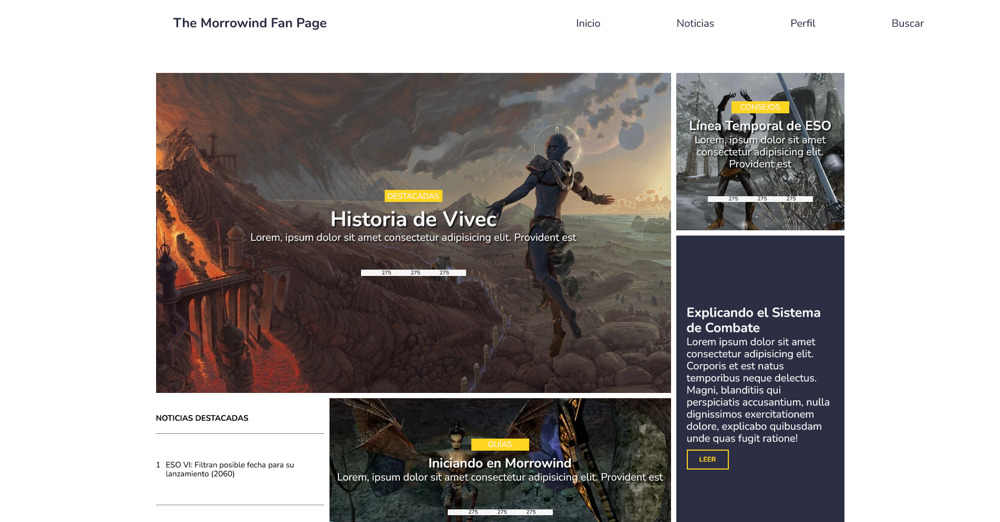

# The Morrowind fanpage
This project is a tribute blog to Bethesda's Morrowind game, I took the opportunity to use Sass and Pug for its development.

---

## Screenshot

---

## Live Demo

- Live Site: https://devnielote.github.io/the-morrowind-fan-page/index.html

---

## Project Purpose

- Show love for the elder scrolls saga
- Responsive design using CSS Grid and Flexbox across multiple breakpoints
- Writing maintainable and modular CSS using Sass preprocessor with mixins and nesting
- Structuring layouts with featured posts, article grids, and profile sections
- Implementing clean and adaptive navigation and UI components

---

## Built with:

- Semantic HTML5 markup
- Sass and Pug preprocessors
- CSS Grid and flexbox
- Mobile-first approach

## Author:

- Well...me
